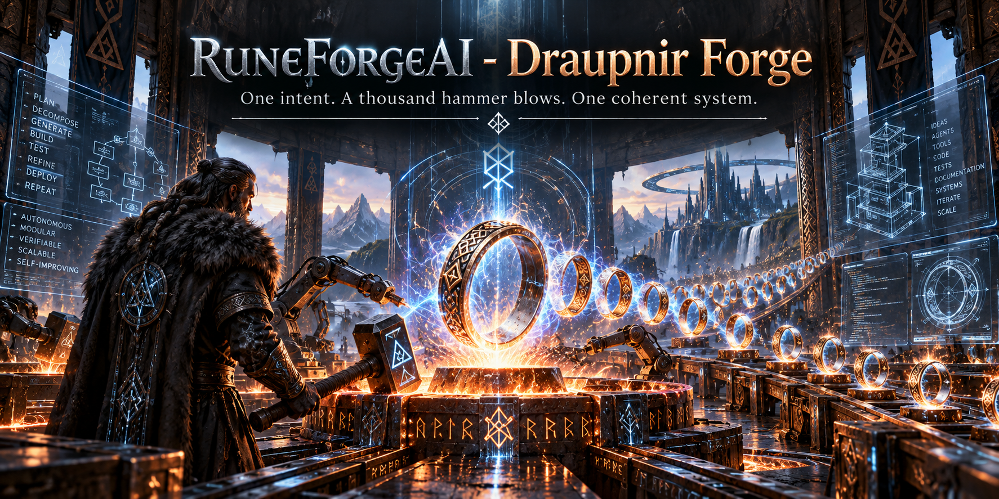
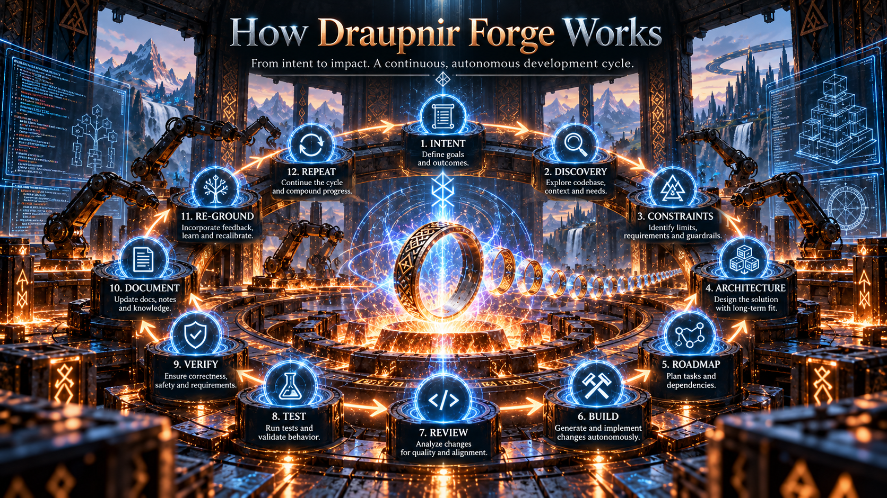
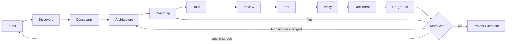
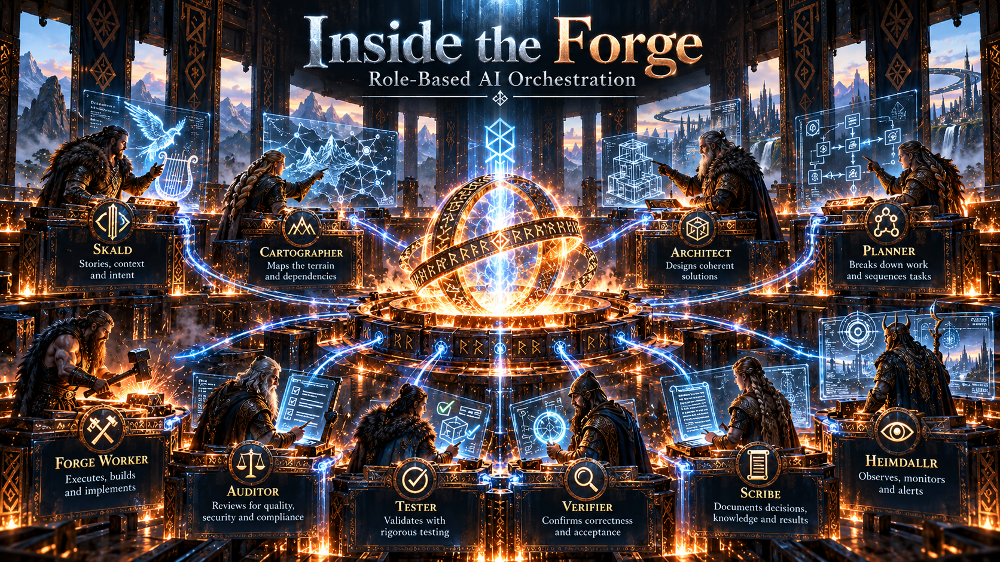
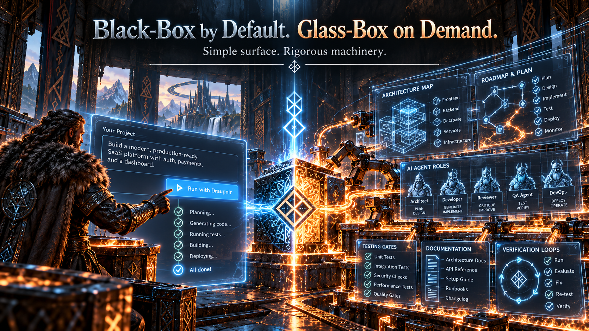
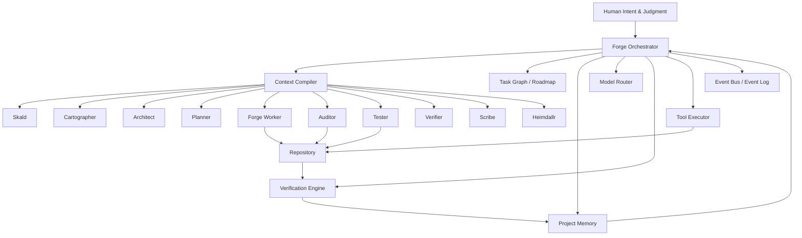

# RuneForgeAI - Draupnir Forge

### **One intent. A thousand hammer blows. One coherent system.**

**Recursive Mythic Engineering for autonomous AI-native software development.**

[](#project-status)
[](#mythic-engineering)
[](#architecture)
[](#license)
[](#license)

</div>

---

## 🔥 What is Draupnir Forge?

**Draupnir Forge** is a proposed black-box-by-default, glass-box-on-demand AI development system that recursively applies **Mythic Engineering**.

The human defines **what should exist, why it matters, what must remain true, and what counts as success**.

The Forge handles as much of the expandable engineering cognition as possible:

- repository discovery
- architecture mapping
- dependency analysis
- roadmap generation
- implementation
- debugging
- testing
- verification
- documentation
- re-grounding
- recovery
- iteration

The goal is not merely to make coding faster.

The goal is to let **one human direct software complexity far beyond what one human could manually implement, remember, or continuously supervise**.

> **Own the definition. Delegate the construction. Verify reality. Preserve continuity.**

---

## ⚒️ Why "Draupnir"?

In Norse tradition, **Draupnir** is Odin's ring that multiplies itself.

That makes it the perfect metaphor for the Forge:

```text
one human intention
        ↓
explicit definition
        ↓
recursive AI engineering
        ↓
many coordinated acts of implementation
        ↓
one coherent system
```

The human does not manually swing every hammer.

The human decides **what is being forged**.

---



## 🔁 How Draupnir Forge Works

Every meaningful unit of work passes through a recurring engineering cycle:



### The cycle

| Phase | Purpose |
|---|---|
| **Intent** | Understand what the human actually wants to exist. |
| **Discovery** | Inspect the real repository, environment, dependencies, and constraints. |
| **Constraints** | Define what must remain true and what must not happen. |
| **Architecture** | Establish domains, ownership, interfaces, state, flows, and invariants. |
| **Roadmap** | Compile the architecture into bounded, dependency-aware work. |
| **Build** | Execute implementation using appropriately scoped AI context. |
| **Review** | Search for drift, contradictions, brittle assumptions, and hidden costs. |
| **Test** | Run actual tests, builds, probes, and runtime checks. |
| **Verify** | Ask whether the result truly satisfies the intended behavior. |
| **Document** | Update the durable external memory of the project. |
| **Re-ground** | Reconcile plans and assumptions with what now actually exists. |
| **Repeat** | Continue until completion, budget limits, or a real human decision boundary. |

---



## 🧠 Inside the Forge

Draupnir Forge does **not** treat "the AI" as one undifferentiated blob.

The system divides cognitive labor into roles.

### 🎼 Skald
Interprets human intent, preserves meaning, identifies ambiguity, and prevents technical implementation from erasing the original vision.

### 🗺️ Cartographer
Maps repositories, dependencies, domains, data flows, hotspots, and actual system structure.

### 🏛️ Architect
Defines subsystem boundaries, ownership, interfaces, invariants, dependency direction, and architecture changes.

### 📜 Planner
Compiles architecture into an ordered roadmap of bounded tasks with dependencies and acceptance criteria.

### 🔨 Forge Worker
Implements code, performs refactors, writes tests, and completes tightly scoped engineering tasks.

### ⚖️ Auditor
Challenges assumptions, finds contradictions, searches for regressions, detects architectural drift, and reviews risk.

### 🧪 Tester
Executes tests and runtime probes. It cares about what the machine **does**, not what an AI claims it should do.

### 🔍 Verifier
Determines whether the implementation actually satisfies the goal, constraints, interfaces, and acceptance criteria.

### ✍️ Scribe
Maintains the project's external memory: architecture, decisions, failures, roadmaps, interfaces, state, and history.

### 👁️ Heimdallr
Watches system health, repeated failures, runaway loops, token budgets, tool failures, and conditions requiring escalation.

---



## 🖤 Black-Box by Default. Glass-Box on Demand.

The default user experience should be almost absurdly simple:

```text
> Build me a local-first research assistant that can index my Markdown
> files, answer questions from them, and preserve exact citations.

Draupnir Forge:
✓ Interpreting intent
✓ Mapping requirements
✓ Designing architecture
✓ Building roadmap
◉ Implementing retrieval pipeline
○ Testing
○ Verification
○ Documentation
```

But underneath that simple surface lives a rigorous engineering machine.

### Black-box mode

Best for users who want outcomes.

They see:

- goal
- current phase
- progress
- decisions requiring human judgment
- health
- failures that matter
- final result

### Glass-box mode

Best for developers, researchers, and obsessively curious humans. 🧙‍♂️⚙️

They can inspect:

- architecture documents
- task graph
- invariants
- agent outputs
- diffs
- test evidence
- decision ledger
- model routing
- token budgets
- event stream
- failed attempts
- verification evidence
- re-grounding history

> **The simpler the surface becomes, the more disciplined the hidden machinery must be.**

---

## 🧭 Mythic Engineering

Draupnir Forge is an automation layer for **Mythic Engineering**.

Mythic Engineering treats software as a living system made of:

- domains
- rules
- interfaces
- memory
- flows
- constraints
- relationships
- state
- invariants
- emergent behavior

Its core rhythm is:

```text
intent
  ↓
constraints
  ↓
architecture
  ↓
plan
  ↓
build
  ↓
verify
  ↓
reflect
```

### Foundational principles

1. **Vision before implementation.**
2. **Architecture before patch accumulation.**
3. **Documentation is cognitive infrastructure.**
4. **AI is scalable cognitive labor, not magic.**
5. **Every subsystem needs ownership and boundaries.**
6. **Intuition is valid, but must become explicit.**
7. **Reality outranks beautiful theory.**
8. **Refactor by ownership, not convenience.**
9. **Invariants matter.**
10. **Continuity is a first-class engineering requirement.**

---

## 🧠 Just-in-Time Learning

Draupnir Forge also assumes a **Just-in-Time Learning** model for the human operator.

The human does **not** need to permanently memorize every technical domain required by a complex project.

Instead:

```text
new decision appears
        ↓
Forge identifies missing human-level knowledge
        ↓
AI teaches the minimum useful conceptual model
        ↓
human understands the decision boundary
        ↓
human supplies judgment / preference / direction
        ↓
Forge resumes autonomous execution
```

This is different from blindly delegating decisions.

The goal is to keep the human at the **highest-value layer of understanding** while allowing AI systems to carry huge volumes of retrievable detail.

### The human should understand enough to govern

The human should know:

- what should exist
- why it exists
- what outcomes matter
- what tradeoffs matter
- what constraints are important
- what risks are unacceptable
- when something feels conceptually wrong
- which decisions require actual human values or preference

The human does **not** need to manually retain:

- every API
- every framework detail
- every dependency
- every algorithm
- every file relationship
- every syntax rule
- every debugging technique
- every implementation alternative

Those can be retrieved, reasoned about, tested, and verified when needed.

---

## 🧬 The Core Scaling Idea

Some systems become too complicated for any one human to keep completely active in biological working memory.

Draupnir Forge treats that as an architectural fact.

### No critical system truth should exist only inside:

- the developer's head
- one conversation
- one LLM context window
- one undocumented implementation
- one temporary agent's memory

Instead, project cognition becomes external and durable.

```text
.mythis/
├── SYSTEM_VISION.md
├── ARCHITECTURE.md
├── DOMAIN_MAP.md
├── INTERFACES.md
├── INVARIANTS.md
├── CONSTRAINTS.md
├── ROADMAP.md
├── DECISIONS.md
├── KNOWN_ISSUES.md
├── CAPABILITY_LEDGER.md
└── PROJECT_STATE.json
```

This externalized architecture becomes a shared cognitive environment for both human and AI.

---

## 🧱 Architecture

Conceptually:



The **Forge Orchestrator** is not merely another coding agent.

It governs:

- process state
- task transitions
- role assignment
- context assembly
- model selection
- retries
- verification gates
- budgets
- recovery
- escalation
- pause/resume
- project completion

Where practical, transitions should be controlled by explicit state rather than leaving the entire workflow to generative improvisation.

---

## 🧠 Context Compiler

One of the key systems inside Draupnir Forge is the **Context Compiler**.

Instead of stuffing the entire repository into every model call, it constructs the smallest sufficient context for the current task.

It may retrieve:

- relevant architecture
- active task definition
- affected domain
- interfaces
- invariants
- source files
- related decisions
- previous failures
- applicable tests

This reduces:

- token waste
- cross-domain confusion
- architectural drift
- irrelevant context
- contradictory instructions

It also allows projects to grow far beyond one model context window.

---

## 🗺️ Roadmap Compiler

The roadmap is not merely a Markdown checklist.

Internally, tasks should be machine-readable objects containing:

```json
{
  "task_id": "T-042",
  "title": "Implement persistent model registry",
  "domain": "model-management",
  "status": "ready",
  "depends_on": ["T-038", "T-040"],
  "goal": "Persist verified model metadata across restarts",
  "constraints": [
    "Do not change public API behavior",
    "SQLite remains the storage backend"
  ],
  "acceptance": [
    "Registry survives process restart",
    "Duplicate model records are rejected",
    "Existing registry tests remain green"
  ]
}
```

If a task repeatedly fails, the Forge should not simply hammer it forever.

Repeated failure can mean:

- the task is too large
- assumptions are wrong
- architecture is incomplete
- context is missing
- dependencies are missing
- the selected model is unsuitable
- human judgment is actually required

Failure becomes **information**.

---

## ✅ Verification Before Completion

A model saying **"done"** is not evidence.

A task becomes complete only after passing relevant gates:

```text
Code Gate
   ↓
Build Gate
   ↓
Test Gate
   ↓
Interface Gate
   ↓
Invariant Gate
   ↓
Runtime Gate
   ↓
Goal Gate
   ↓
Documentation Gate
```

The verifier asks:

> **Did the requested thing actually become true?**

A beautiful diff that fails the real-world objective is still a failed task.

---

## 🧯 Self-Repair Without Self-Deception

Draupnir Forge may repair its own failures automatically.

But:

```text
test failed
   ↓
classify failure
   ↓
preserve evidence
   ↓
determine whether code, test, requirement, context, or architecture is wrong
   ↓
repair / re-plan / re-architect
   ↓
re-run verification
```

Never:

```text
test failed
   ↓
change test until green
   ↓
declare victory
```

Tests are witnesses, not enemies.

---

## 🧰 User Autonomy Levels

### 🪶 Guided

Ask before:

- major architecture changes
- new dependencies
- destructive refactors
- deployment
- external services

### ⚔️ Trusted

Continue autonomously inside the agreed architecture.

Ask only for:

- genuine preference decisions
- irreversible external actions
- major goal changes
- unresolved ambiguity

### 🔥 Deep Forge

Continue until:

- the project is complete
- the resource budget is exhausted
- a hard blocker appears
- a true human decision is required

This is the closest mode to:

> **Give the Forge a defined roadmap and let it work until the tokens run out.**

---

## 🧼 Clean-Room Capability

Draupnir Forge should support clean-room system research.

When building something inspired by another application or platform, the Forge can study, where legally and ethically appropriate:

- public documentation
- APIs
- protocols
- command behavior
- file formats
- compatibility requirements
- published benchmarks
- publicly observable behavior
- properly licensed open-source primitives

Then independently derive:

```text
observed behavior
      ↓
requirements model
      ↓
compatibility map
      ↓
independent architecture
      ↓
roadmap
      ↓
implementation
```

The point is to learn from **behavior and ideas** without quietly turning research into source copying.

---

## 📚 Project Modes

### New System

```text
Intent
  ↓
Requirements
  ↓
Technical Research
  ↓
Constraints
  ↓
Architecture
  ↓
Scaffold
  ↓
Thin Vertical Slice
  ↓
Verify
  ↓
Expand
```

### Existing System

```text
Scan
  ↓
Map
  ↓
Build Domain Model
  ↓
Inspect Tests
  ↓
Compare Documentation to Reality
  ↓
Identify Risks
  ↓
Create Change Roadmap
  ↓
Execute
```

**Rule:** *Map before modifying.*

---

## 🧪 Thin Vertical Slices

Draupnir Forge should resist generating a huge speculative system in one pass.

Instead, prove real behavior end-to-end:

```text
user action
   ↓
input / UI
   ↓
API / interface
   ↓
logic
   ↓
state
   ↓
persistence
   ↓
result
   ↓
test
```

Learn from reality.

Then expand.

---

## 📈 What Success Looks Like

The interesting metric is not lines of AI-generated code.

It is:

> ## **Verified engineering output per minute of required human attention.**

Other useful measurements:

- autonomous run length
- human interventions per task
- token cost per verified capability
- regression frequency
- architecture drift
- repair success rate
- documentation accuracy
- number of tasks completed without human intervention
- time from high-level intent to verified working behavior

---

## 🏗️ MVP

The first useful Draupnir Forge does not need to be enormous.

### MVP

- CLI-first
- one primary model provider
- existing-repository mode
- new-project mode
- repository mapping
- system vision extraction
- architecture generation
- roadmap generation
- bounded implementation loop
- code modification
- shell/test execution
- auditor pass
- verifier pass
- living Markdown memory
- Git checkpoints
- pause/resume
- human escalation
- token/cost budget

### Later

- TUI / GUI
- multi-provider routing
- local model pools
- distributed workers
- UI screenshot testing
- learned model routing
- multi-repository projects
- plugin ecosystem
- remote agent workers
- organization/business orchestration
- Verðandi integration
- Muninn long-term memory
- Skuld-style verification ledger

---

## 🌌 Long-Term Vision

Draupnir Forge starts with software because code provides unusually strong machine-verifiable evidence.

But the deeper pattern is domain-general:

```text
human intent
      ↓
domain model
      ↓
explicit constraints
      ↓
architecture
      ↓
specialist AI cognition
      ↓
execution
      ↓
evidence
      ↓
verification
      ↓
persistent memory
      ↓
recursive improvement
```

Future descendants could potentially orchestrate:

- software engineering
- research
- publishing
- data analysis
- content pipelines
- digital operations
- autonomous agent ecosystems
- business processes

The larger idea is **one human directing complexity that exceeds what one human could personally retain or execute**.

---

## 🔨 The Twelve Laws of the Forge

> **1. Human intent outranks model convenience.**  
> **2. Reality outranks generated explanation.**  
> **3. Architecture outranks patch accumulation.**  
> **4. Definition precedes delegation.**  
> **5. No critical system truth should live only in one mind or one context window.**  
> **6. Every subsystem needs an owner and a boundary.**  
> **7. Every important change must leave evidence.**  
> **8. The agent that implements a change should not be its sole judge.**  
> **9. Failure should create knowledge, not blind repetition.**  
> **10. Ask the human for judgment, not permission to perform obvious work.**  
> **11. Continuity is a first-class engineering requirement.**  
> **12. The simpler the surface becomes, the more disciplined the hidden machinery must be.**

---

## 🗂️ Proposed Repository Structure

```text
RuneForgeAI-Draupnir-Forge/
├── README.md
├── LICENSE
├── DRAUPNIR_FORGE_SPEC.md
├── MYTHIC_ENGINEERING.md
├── assets/
│   ├── draupnir-forge-hero.png
│   ├── draupnir-forge-cycle.png
│   ├── inside-the-forge.png
│   └── black-box-glass-box.png
├── docs/
│   ├── ARCHITECTURE.md
│   ├── DOMAIN_MAP.md
│   ├── EVENT_MODEL.md
│   ├── SECURITY_MODEL.md
│   └── ROADMAP.md
├── src/
│   ├── orchestrator/
│   ├── roles/
│   ├── context/
│   ├── memory/
│   ├── roadmap/
│   ├── verification/
│   ├── models/
│   ├── tools/
│   └── events/
├── tests/
└── examples/
```

---

## 🚧 Project Status

**Concept / Future Project**

Draupnir Forge is currently a design specification and future RuneForgeAI project.

This repository is intended to preserve the architecture, philosophy, visual identity, and initial technical direction until active development begins.

See:

**[`DRAUPNIR_FORGE_SPEC.md`](DRAUPNIR_FORGE_SPEC.md)**

for the deeper project specification.

---

## 🪪 License

### Software

Proposed license:

**GNU Affero General Public License v3.0 or later**

```text
SPDX-License-Identifier: AGPL-3.0-or-later
```

The intention is to keep improvements to the Forge open even when modified versions are operated as network services.

### Documentation and original project artwork

**Creative Commons Attribution-ShareAlike 4.0 International**

```text
CC BY-SA 4.0
```

The generated project artwork should be included only under terms compatible with the actual rights held by the repository owner.

---

## 🧿 RuneForgeAI

Draupnir Forge belongs to the broader **RuneForgeAI** ecosystem of experimental AI systems, local intelligence infrastructure, agent architectures, persistent memory, world modeling, and Mythic Engineering.

**GitHub:** [github.com/hrabanazviking](https://github.com/hrabanazviking)

---

<div align="center">

## ⚒️ One intent. A thousand hammer blows. One coherent system.

**Define the world you want.  
Give the Forge its laws.  
Let intelligence do the hammering.**

</div>
