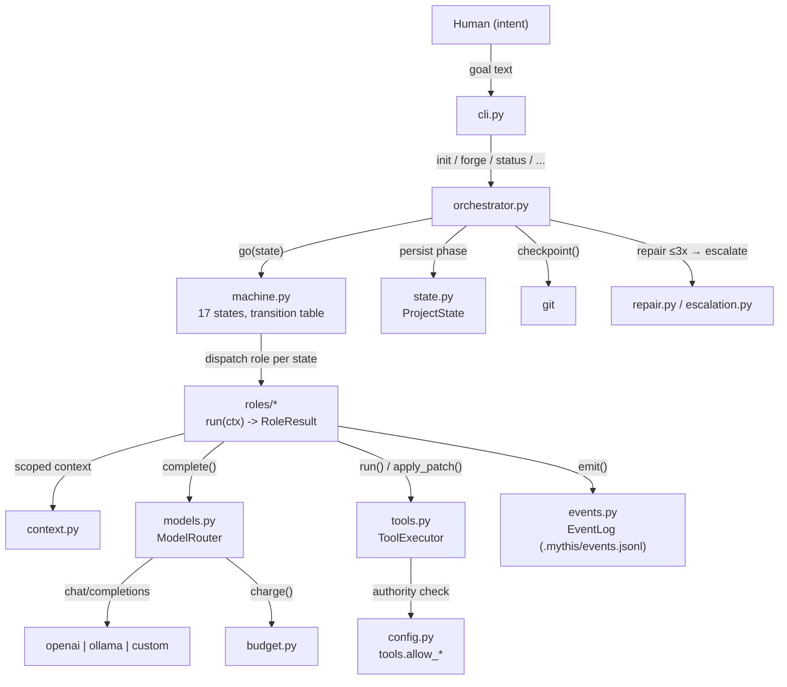

# Draupnir Forge — Architecture

*Slice 43 canonical doc, refreshed through slice 49. Describes the
repository as it actually is (slices 1–45 and 48–49 landed; 46, 47,
50 pending). Hand-written from the source —
if the code disagrees with this document, the code wins and this
document must be fixed.*

## 1. What the Forge is

Draupnir Forge is an autonomous software-development system: a human
supplies intent ("build X"), and the Forge walks a governed state
machine — discovery, definition, architecture, roadmap, then a
task-by-task implement → review → test → verify loop — until the work
is done or a human must decide. Every important action is recorded as
an event in an append-only ledger, and every tool action runs under an
explicit authority model.

The twelve Forge Laws (`FORGE_LAWS` in `src/draupnir_forge/__init__.py`)
bind every subsystem; the Auditor role checks drift against them.

## 2. Package layout

```
draupnir-w5c/
├── pyproject.toml              # build; console script `draupnir`
├── data/                       # YAML data files — settings live here,
│                               # never hardcoded in Python
├── docs/                       # canonical docs (this file's kin)
├── examples/                   # worked examples (slice 45)
├── src/draupnir_forge/
│   ├── __init__.py             # __version__, FORGE_LAWS (12 laws)
│   ├── __main__.py             # `python -m draupnir_forge` → CLI
│   ├── _paths.py               # data-file resolution (env → resources
│   │                           #   → walk-up → ./data); never raises
│   ├── cli.py                  # argparse; 9 subcommands
│   ├── ui.py                   # black-box progress panel (slice 31)
│   ├── config.py               # ForgeConfig: 5-layer YAML config
│   ├── log.py                  # logging infra, ForgeFormatter
│   ├── events.py               # EventType (18), ForgeEvent, EventLog
│   ├── state.py                # ProjectState, ALLOWED_TRANSITIONS
│   ├── budget.py               # token/cost budget, price table
│   ├── machine.py              # 17-state ForgeMachine (governs moves)
│   ├── orchestrator.py         # the core loop (drives the machine)
│   ├── roles/                  # the ten roles (see §4)
│   ├── models.py               # ModelRouter: multi-provider OpenAI-
│   │                           # compatible client (slices 23 + 44)
│   ├── tools.py                # ToolExecutor + apply_patch, authority
│   ├── context.py              # ContextCompiler: task-scoped context
│   ├── roadmap.py              # TaskGraph runtime engine
│   ├── verification.py         # the 8 acceptance gates
│   ├── failures.py             # failure classes + escalation ladder
│   ├── escalation.py           # human-escalation engine
│   ├── checkpoints.py          # git checkpoints, pause/resume
│   ├── memory.py               # .mythis/ canonical docs
│   ├── decisions.py            # decision ledger
│   ├── discovery.py            # discovery-report generator
│   ├── archdocs.py             # arch-doc renderers (mermaid)
│   ├── drift.py                # architecture drift detection
│   ├── repair.py               # self-repair engine (max 3 attempts)
│   ├── reground.py             # re-grounding cycle
│   ├── modes_new.py            # green-field project mode
│   ├── modes_existing.py       # existing-repo mode
│   └── tasks.py                # ForgeTask re-export (canonical home:
│                               # roles/planner.py)
└── tests/                      # unittest suite (stdlib only)
```

## 3. Module responsibilities

| Layer | Modules | Job |
|---|---|---|
| Entry | `__main__`, `cli` | Parse args, dispatch to handlers, exit codes (0 ok, 2 usage) |
| Interface | `ui` | Pure-function progress panel over state + roadmap |
| Configuration | `config`, `_paths` | Layered YAML config; locate data files without crashing |
| Foundation | `log`, `events`, `state`, `budget` | Logging, event ledger, persisted phase, spend caps |
| Governance | `machine` | Owns legal state moves; illegal moves raise `IllegalTransition` |
| Direction | `orchestrator` | Runs the loop: state → role → transitions → repair/replan/escalate |
| Intelligence | `roles/*` | Ten roles, each `run(ctx) -> RoleResult` |
| World access | `models`, `tools`, `checkpoints` | Model APIs, shell/patch execution, git |
| Task runtime | `roadmap`, `context`, `tasks` | Task graph, scoped context packages, task schema |
| Quality | `verification`, `failures`, `drift`, `repair`, `reground` | Gates, classification, drift, repair, re-grounding |
| Knowledge | `memory`, `decisions`, `discovery`, `archdocs` | `.mythis/` docs, ledger, reports, renderers |
| Modes | `modes_new`, `modes_existing` | Green-field vs existing-repo entry rites |
| Human | `escalation` | When to ask, how to pause and resume |

### The ten roles (`roles/`)

`base` defines the contract (`Role.run(ctx: RoleContext) -> RoleResult`,
`RoleRegistry`); the ten workers are:

- **Skald** — intent → `Vision` (goal, priorities, non-goals, success criteria, ambiguities)
- **Cartographer** — repo walk → `DOMAIN_MAP.md` + import graph (AST-based)
- **Architect** — vision + domain map → `ARCHITECTURE.md`, `INTERFACES.md`, `INVARIANTS.md`
- **Planner** — architecture + vision → task graph (`T-001…`, topological order)
- **ForgeWorker** — executes one bounded task: applies patches, runs commands, files evidence
- **Auditor** — adversarial review of diffs against `data/audit_checks.yaml`
- **Tester** — runs the test suite, parses results, classifies failures; never edits tests to pass
- **Verifier** — 8-gate acceptance verdict per task
- **Scribe** — owns `.mythis/` canonical docs; append-only history
- **Heimdallr** — loop health: repeated failures, runaway, budget pressure

## 4. Data flow



The happy path through the machine:

```
INTAKE → DISCOVERY → DEFINITION → ARCHITECTURE → ROADMAP → TASK_READY
  → IMPLEMENTING → REVIEWING → TESTING → VERIFYING → COMPLETE_TASK
  → (TASK_READY …) → DOCUMENTING → PROJECT_COMPLETE
```

Failure detours: `REPAIR` (bounded self-repair) → `REPLAN` (roadmap
revision) → `HUMAN_DECISION` (pause with `.mythis/awaiting_human.md`).
`REGROUNDING` re-runs the Cartographer when drift is detected.

## 5. Project memory (`.mythis/`)

Each forged project carries its own memory root, created by
`draupnir init`:

```
.mythis/
├── PROJECT_STATE.json     # phase, goal, counters (atomic writes)
├── SYSTEM_VISION.md       # Skald's reading of intent
├── ARCHITECTURE.md        # Architect's design
├── DOMAIN_MAP.md          # Cartographer's map
├── INTERFACES.md / INVARIANTS.md / CONSTRAINTS.md
├── ROADMAP.md + roadmap.json
├── DECISIONS.md           # decision ledger (append-only)
├── KNOWN_ISSUES.md / CAPABILITY_LEDGER.md
├── events.jsonl           # the event ledger (fsync per append)
├── budget.json
├── config.yaml            # per-project overrides
├── evidence/              # diffs, test logs
├── sessions/              # per-run records
└── logs/forge.log         # rotating log
```

Only the Scribe writes the canonical docs; the worker is refused
`.mythis/` paths by `apply_patch`.

## 6. Cross-cutting rules

- **Data, not code:** all settings and checklists live in `data/*.yaml`
  (`default_config.yaml`, `config_schema.yaml`, `role_models.yaml`,
  `audit_checks.yaml`, …). Code reads them via `_paths`.
- **Fault tolerance:** subsystem boundaries are wrapped in try/except;
  corrupt state files are backed up and re-created, never fatal.
- **No silent failures:** denied tool actions raise `AuthorityDenied`;
  misconfigured providers raise `ModelError` with a clear message.
- **Evidence:** every important change leaves evidence — events, diffs,
  test logs, git commits with `Forge-Task:` trailers.
- **Tests are witnesses:** no role may edit tests to make them pass.
- **Stdlib only:** the runtime depends on PyYAML alone; tests use
  `unittest`. HTTP goes through `urllib` (mocked in tests).

## 7. What's not here yet

Slices 46, 47, 50 remain: the slice-46 dogfood run (real forge loop
on a tiny feature), the slice-47 end-to-end integration test, and
the slice-50 release slice. This document will grow with them.
